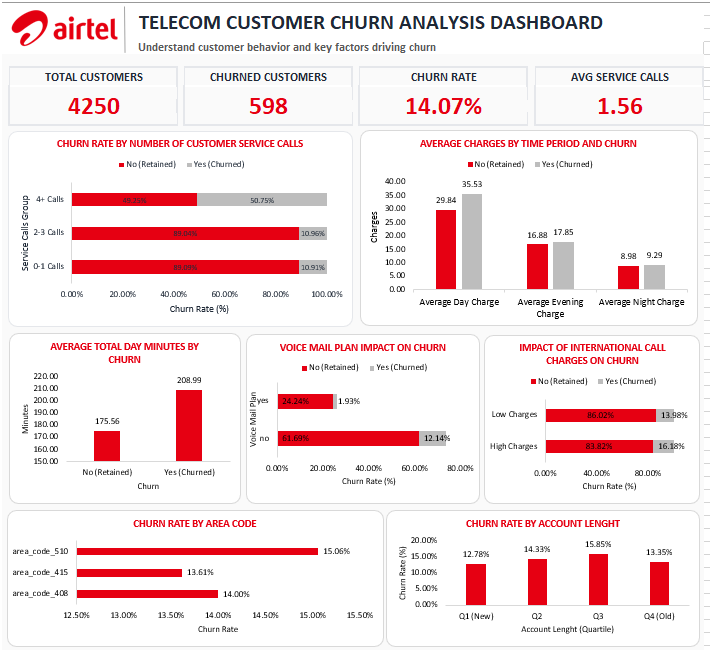

# Airtel Telecom Customer Churn Analysis

## Dashboard Preview

---

# Project Overview

This project focuses on analyzing customer churn for Airtel, a leading telecommunications company. The objective is to identify the key factors influencing customer attrition and provide actionable recommendations to improve customer retention, customer satisfaction, and long-term business growth.

The analysis was performed using Microsoft Excel, Pivot Tables, Pivot Charts, Power Pivot, and DAX measures to uncover patterns in customer behavior, service usage, pricing, and customer support interactions.

---

# Problem Statement

Airtel has observed an increase in the number of customers discontinuing their telecom services. Rising customer churn can negatively impact:

* Revenue growth
* Market share
* Customer acquisition costs
* Brand loyalty
* Long-term profitability

The goal is to identify the drivers of churn and help management implement effective retention strategies.

---

# Objective

* Analyze customer churn patterns and trends
* Identify factors contributing to customer attrition
* Evaluate the impact of service usage, pricing, and customer support on churn
* Discover high-risk customer segments
* Provide data-driven recommendations to improve customer retention

---

# Stakeholders

## Internal Stakeholders

* Customer Retention Team
* Customer Service Department
* Marketing Team
* Product Management Team
* Revenue Management Team
* Senior Leadership

## External Stakeholders

* Telecom Service Partners
* Marketing Agencies
* Customer Support Vendors

---

# Dataset Information

The dataset contains customer-level telecommunications data and customer churn status.

## Key Features

### Customer Information

* State
* Area Code
* Account Length

### Service Plans

* International Plan
* Voice Mail Plan

### Usage Metrics

* Total Day Minutes
* Total Evening Minutes
* Total Night Minutes
* Total International Minutes

### Call Activity

* Total Day Calls
* Total Evening Calls
* Total Night Calls
* Total International Calls

### Charges

* Total Day Charge
* Total Evening Charge
* Total Night Charge
* Total International Charge

### Customer Support

* Number of Customer Service Calls

### Target Variable

* Churn (Yes / No)

---

# Key Findings

## Customer Churn Overview

* Total Customers: **4,250**
* Churned Customers: **598**
* Overall Churn Rate: **14.07%**

---

## Customer Service Calls Are the Strongest Churn Indicator

| Service Call Group | Churn Rate |
| ------------------ | ---------- |
| 0–1 Calls          | 10.91%     |
| 2–3 Calls          | 10.96%     |
| 4+ Calls           | 50.75%     |

**Insight:** Customers contacting support more than three times are significantly more likely to churn.

---

## International Plan Users Churn More

* Customers without an international plan: **14.03% churn**
* Customers with an international plan: **25.87% churn**

**Insight:** International plan subscribers represent a high-risk customer segment.

---

## Voice Mail Plan Improves Retention

* Customers without a voice mail plan: **12.14% churn**
* Customers with a voice mail plan: **1.93% churn**

**Insight:** Value-added services contribute positively to customer retention.

---

## Higher Usage Leads to Higher Churn

| Customer Status | Average Day Minutes |
| --------------- | ------------------- |
| Retained        | 175.56              |
| Churned         | 208.99              |

**Insight:** Heavy users are more likely to churn, potentially due to pricing concerns.

---

## Churned Customers Pay Higher Charges

| Charge Type    | Retained | Churned |
| -------------- | -------- | ------- |
| Day Charge     | 29.84    | 35.53   |
| Evening Charge | 16.88    | 17.85   |
| Night Charge   | 8.98     | 9.29    |

**Insight:** Churned customers consistently incur higher service charges.

---

## Area Code Has Minimal Impact

| Area Code | Churn Rate |
| --------- | ---------- |
| 510       | 15.06%     |
| 408       | 14.00%     |
| 415       | 13.61%     |

**Insight:** Geographic location is not a significant churn driver.

---

## Account Length Has Weak Correlation with Churn

| Account Length Group | Churn Rate |
| -------------------- | ---------- |
| Q1 (New)             | 12.78%     |
| Q2                   | 14.33%     |
| Q3                   | 15.85%     |
| Q4 (Old)             | 13.35%     |

**Correlation Coefficient:** 0.02

**Insight:** Customer tenure has a weak relationship with churn.

---

# Recommendations

### Improve Customer Service Resolution

* Reduce repeat customer service interactions
* Improve first-call resolution rates
* Monitor customers with multiple support requests

### Reevaluate International Plans

* Review pricing structure
* Offer more competitive international packages
* Introduce bundled plans for frequent international users

### Promote Value-Added Services

* Encourage voice mail plan adoption
* Improve awareness of available service features

### Target High Usage Customers

* Develop personalized plans for heavy users
* Provide loyalty discounts and retention offers

### Strengthen Customer Engagement

* Focus on proactive customer communication
* Monitor high-risk customer segments regularly

---

# Author

**Priyam Jain**

Data Analyst
